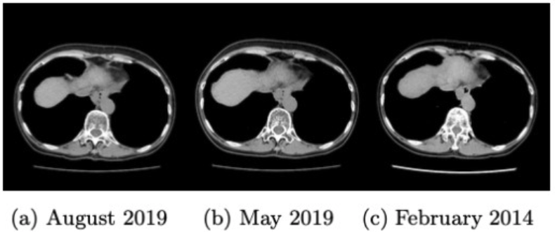
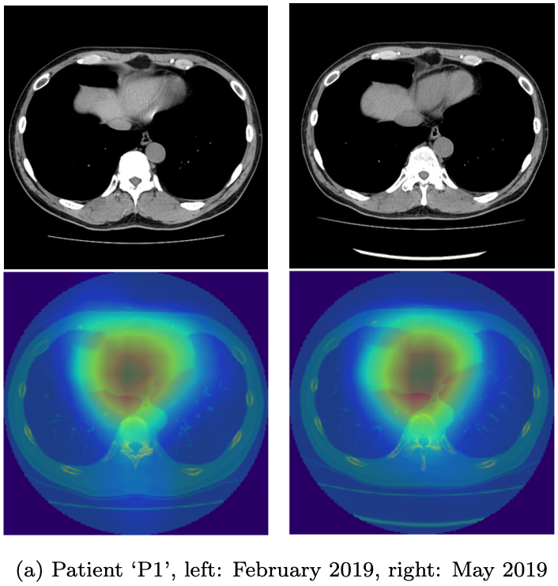

# Identifying the Corresponding CT Slices among the Different Scans via Deep Metric Learning
To observe the condition of a patient in long-term medical treatment, it is a common practice to compare computed tomography (CT) slices from current scans with existing CT slices from past scans of the same patient. A medical practitioner needs to identify the corresponding CT slices among the scans of different dates before being
able to compare these CT slices, and the burden of identifying the right slice escalates as the number of follow-up examinations increase. Therefore, this *ct-slice-matching* project aims to identify the most similar CT slice from prior dates when a slice of interest is specified, by applying deep metric learning to quantify the
similarity of CT slices captured on different scan dates. On a task to pinpoint
the matching CT slices of different dates, a trained network can discover similar objects between slices and gives an output equivalent to visual assessment by an experienced radiologist.

## Dependencies
* [Keras]() v2.2.4 with [Tensorflow]() v1.13.1 backend
* [Scikit Learn]() v.0.21.2
* Other python libraries:
  - matplotlib v3.1.1
  - numpy v.1.16.4
  - pandas v0.24.2
  - pydicom v1.2.2
  - skimage v0.16.2
  - opencv v3.4.4

## How to use
1. Train and evaluate a network
   ```sh
   python train.py --train --eval
   python train.py EXPERIMENT_DIR --train # Continue to train model on EXPERIMENT_DIR or name the directory of the resulting model as EXPERIMENT_DIR if it does not exist
   python train.py EXPERIMENT_DIR --eval DATASET.csv  # evaluate trained model on EXPERIMENT_DIR using dataset from DATASET.csv
   ```
2. Visualize similarity
   ```sh
   ```

## Sample Result
- Corresponding CT slices according to the trained network.
  

 Leftmost image is the input slice, selected from August 2019 scan, and the other two slices are selected by the network among slices from scans taken in May 2019 and February 2014.
- Salient maps visualization
  

  Although being trained on unannotated data, the trained network is able to localize similar structures between slices.
